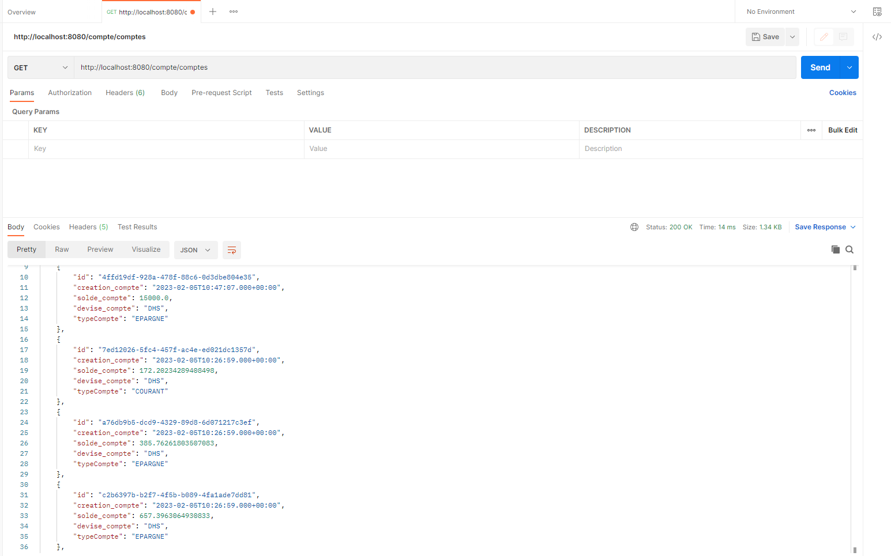
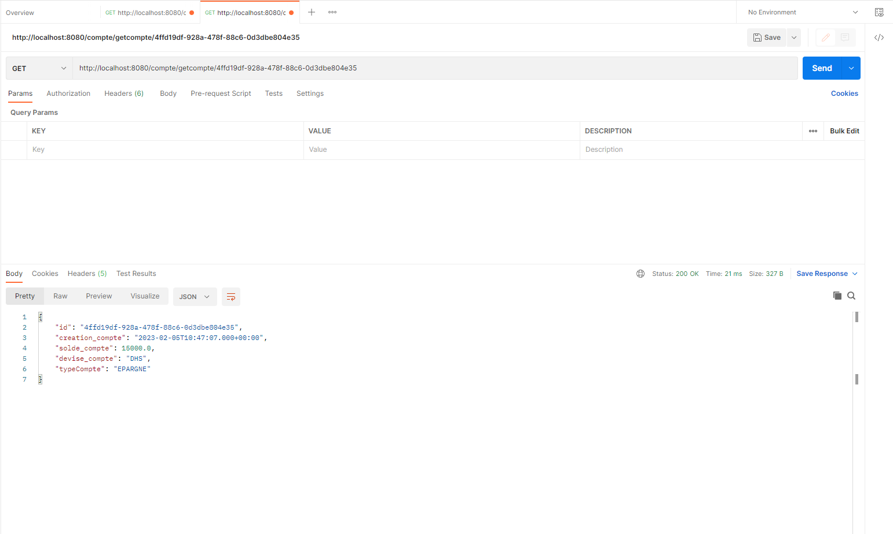

<h1>Rapport du projet REST-GRAPHEQL</h1>

Les trois couches du projet : 

<ul>
<li>Couche WEB</li>
<li>Couche Service</li>
<li>Couche DAO</li>
</ul>
<h2>On Teste la couche web à l'aide de Postman</h2>

<h2>On Teste le web service avec GraphQL</h2>

